<div align="center">
  
<!-- Header Banner -->


<!-- Animated SVG Badges -->
<p>
  
  
  
  
  
</p>

<p>
  
  
  
  
</p>

**A modern, full-stack lost and found management system for educational institutions**

[Demo](#) • [Documentation](#-documentation) • [Contributing](#-contributing) • [Report Bug](#)

</div>

---

## 🛠️ Tech Stack

### Frontend Technologies

| Technology | Version | Purpose |
|:-----------|:-------:|:--------|
|  **Next.js** | `16.1` | React framework with App Router, server components, and Turbopack for blazing-fast development builds |
|  **React** | `19` | UI library with latest concurrent features, hooks, and server components support |
|  **Framer Motion** | `12` | Production-ready animation library for smooth transitions, gestures, and scroll-triggered effects |
|  **CSS Modules** | - | Scoped component styling with zero conflicts and full CSS features |
| 🌊 **Lenis** | `1.3` | Smooth scroll library for premium scrolling experience |

### Backend Technologies

| Technology | Version | Purpose |
|:-----------|:-------:|:--------|
|  **Next.js API Routes** | `16.1` | Serverless API endpoints running on Edge/Node.js runtime |
|  **Supabase** | `2.90` | PostgreSQL database with real-time subscriptions and Row Level Security |
|  **JWT (jsonwebtoken)** | `9.0` | Stateless authentication with signed tokens |
| 🔐 **bcryptjs** | `3.0` | Password hashing with configurable salt rounds |
| ⚡ **Custom Cache Layer** | - | In-memory caching with TTL for API response optimization |

### Database

| Technology | Purpose |
|:-----------|:--------|
|  **PostgreSQL** | Relational database via Supabase with ACID compliance |
| 🔒 **Row Level Security** | Database-level access control policies |
| 🔗 **Foreign Key Relations** | Referential integrity between users and items |

### Development & Build Tools

| Tool | Purpose |
|:-----|:--------|
|  **Bun** | Ultra-fast JavaScript runtime & package manager (3x faster than npm) |
| ⚡ **Turbopack** | Next.js bundler for instant HMR in development |
|  **ESLint** | Code quality and consistency enforcement |

---

## 🏗️ Architecture

### System Overview

```mermaid
flowchart TB
    subgraph Client["🖥️ Client Layer"]
        Landing["Landing Page"]
        Student["Student Dashboard"]
        Admin["Admin Dashboard"]
        Director["Director Dashboard"]
    end
    
    subgraph API["⚙️ API Layer (Next.js)"]
        Auth["/api/auth"]
        StudentAPI["/api/student"]
        AdminAPI["/api/admin"]
        DirectorAPI["/api/director"]
    end
    
    subgraph Services["🔧 Service Layer"]
        Supabase["Supabase Client\n(Singleton)"]
        JWT["JWT Handler"]
        Cache["Cache Layer\n(In-Memory)"]
    end
    
    subgraph DB["🗄️ Database"]
        PostgreSQL["Supabase PostgreSQL"]
    end
    
    Client --> API
    API --> Services
    Services --> DB
```



### Authentication Flow


### Component Structure

```
src/
├── 📂 app/                    # Next.js App Router
│   ├── 📂 api/                # 22 API endpoints
│   ├── 📄 page.js             # Landing page
│   ├── 📂 LogIn/              # Authentication
│   ├── 📂 StudentDashboard/   # Student portal
│   ├── 📂 AdminDashboard/     # Staff portal
│   └── 📂 DirectorDashboard/  # Director portal
│
├── 📂 components/             # 16 Reusable components
│   ├── Hero/                  # Landing hero section
│   ├── Navbar/                # Fixed navigation
│   ├── ScrollSection/         # Scroll animations
│   ├── Toast/                 # Notifications
│   └── ...                    # More components
│
└── 📂 lib/                    # Utilities
    ├── supabase.js            # DB client (singleton)
    ├── supabase-auth.js       # Auth helpers
    └── cache.js               # Caching system
```

---

## 📋 Overview

### What It Is

Lost & Found Portal is a comprehensive web application designed to streamline the management of lost and found items in educational institutions. It provides a unified platform connecting **students**, **administrators**, and **directors** with role-based access control.

### The Problem

Educational institutions struggle with:
- 📌 **Inefficient tracking** - Items pile up, manual matching
- 📌 **Disorganized records** - No central database
- 📌 **Poor communication** - Students don't know if items are found
- 📌 **Time-consuming** - Staff spend hours managing items

### Our Solution

A digital platform that:
- ✅ **Centralizes** all lost and found operations
- ✅ **Automates** status tracking and workflows
- ✅ **Empowers** students with real-time updates
- ✅ **Provides** powerful admin tools

---

## ✨ Features

### 🎨 Premium UI/UX
- **Glassmorphic Design** with backdrop blur effects
- **Catppuccin Mocha** dark theme palette
- **Scroll stacking animations** on landing page
- **Mobile-optimized** bottom-sheet modals
- **Custom components**: Toast, DatePicker, ConfirmDialog

### 🔐 Authentication & Security
- JWT-based stateless authentication
- Role-based access control (Student/Admin/Director)
- Password hashing with bcrypt
- Protected API routes
- Auto token expiration

### 📦 Item Management
- Unique tracking IDs (e.g., `LF-ABC123`)
- Status workflow: Lost → Found → Claimed → Returned
- 8 category types
- Full-text search across all fields
- Filtering and sorting

### 📊 Analytics
- Real-time statistics dashboard
- Items by status/category
- Resolution metrics

---

## 🚀 Getting Started

### Prerequisites

```bash
# Required
- Bun (or Node.js 18+)
- Supabase account
- Git
```

### Quick Start

```bash
# 1. Clone the repository
git clone https://github.com/yourusername/lost-and-found.git
cd lost-and-found

# 2. Install dependencies
bun install

# 3. Configure environment
cp .env.local.example .env.local
# Edit .env.local with your Supabase credentials

# 4. Seed database (first time)
bun run seed:director

# 5. Start development server
bun run dev

# 6. Open http://localhost:3000
```

### Environment Variables

```env
NEXT_PUBLIC_SUPABASE_URL=your_supabase_url
SUPABASE_SERVICE_ROLE_KEY=your_service_role_key
JWT_SECRET=your_jwt_secret_here
```

---

## 📚 Documentation

### API Endpoints

<details>
<summary><b>Authentication</b></summary>

| Method | Endpoint | Description |
|--------|----------|-------------|
| `POST` | `/api/auth/login` | Student/Admin login |
| `POST` | `/api/auth/director/login` | Director login |
| `POST` | `/api/auth/director/verify` | Verify token |

</details>

<details>
<summary><b>Student Routes</b></summary>

| Method | Endpoint | Description |
|--------|----------|-------------|
| `GET` | `/api/student/requests` | Get own reports |
| `POST` | `/api/student/requests` | Create report |
| `DELETE` | `/api/student/requests` | Delete report |

</details>

<details>
<summary><b>Admin Routes</b></summary>

| Method | Endpoint | Description |
|--------|----------|-------------|
| `GET` | `/api/admin/items` | List all items |
| `POST` | `/api/admin/items-new` | Create item |
| `PUT` | `/api/admin/items-new` | Update item |
| `DELETE` | `/api/admin/items-new` | Delete item |
| `GET` | `/api/admin/students` | List students |
| `GET` | `/api/admin/stats` | Get statistics |

</details>

<details>
<summary><b>Director Routes</b></summary>

| Method | Endpoint | Description |
|--------|----------|-------------|
| `GET` | `/api/director/users` | List all users |
| `POST` | `/api/director/users` | Create user |
| `PUT` | `/api/director/users` | Update user |
| `DELETE` | `/api/director/users` | Delete user |

</details>

### Database Schema

<details>
<summary><b>Users Table</b></summary>

```sql
CREATE TABLE users (
  id UUID PRIMARY KEY,
  username VARCHAR(50) UNIQUE NOT NULL,
  email VARCHAR(255) UNIQUE NOT NULL,
  password_hash VARCHAR(255) NOT NULL,
  role VARCHAR(20) DEFAULT 'student',
  is_active BOOLEAN DEFAULT true,
  created_at TIMESTAMP DEFAULT NOW()
);
```

</details>

<details>
<summary><b>Lost Items Table</b></summary>

```sql
CREATE TABLE lost_items (
  id SERIAL PRIMARY KEY,
  unique_item_id VARCHAR(20) UNIQUE,
  name VARCHAR(255) NOT NULL,
  description TEXT,
  category VARCHAR(50),
  status VARCHAR(20) DEFAULT 'lost',
  owner_user_id UUID REFERENCES users(id),
  created_at TIMESTAMP DEFAULT NOW()
);
```

</details>

---

## 🔮 Roadmap

- [ ] **v1.1** - AI-powered item matching
- [ ] **v1.2** - Email/SMS notifications
- [ ] **v1.3** - Image uploads & QR codes
- [ ] **v2.0** - Progressive Web App (PWA)
- [ ] **v3.0** - Multi-campus & SSO support

---

## 🤝 Contributing

Contributions are welcome! Please read [CONTRIBUTING.md](CONTRIBUTING.md) before submitting a PR.

1. Fork the repository
2. Create your feature branch (`git checkout -b feature/AmazingFeature`)
3. Commit changes (`git commit -m 'Add AmazingFeature'`)
4. Push to branch (`git push origin feature/AmazingFeature`)
5. Open a Pull Request

---

## 📄 License

This project is licensed under the **MIT License** - see the [LICENSE](LICENSE) file for details.

```
MIT License - You are free to use, modify, and distribute this software
with attribution. See LICENSE for full terms.
```

---

<div align="center">


**Built with ❤️ for educational institutions**

</div>
